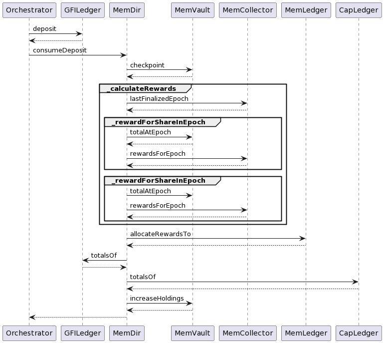

# MembershipOrchestrator

MembershipOrchestrator.sol audit. This contract is the entry point for the Membership Vaults so it
should be carefully scrutinized.

# Summary

I found a couple of medium severity issues that should be fixed before going to production.

- _collectRewards_ allows someone else to initiate my rewards collection

  - **Severity**: 🟡 Medimum
  - **Description**: Note this is NOT a theft of funds. Rewards are sent to the correct address, but anyone can
    initiate. This opens up various griefing attacks
    - `owner` could be a smart contract that executes important logic post-claim. If someone else initiate the
      rewards collection then that logic would be skipped.
    - Reward collection is a taxable event. A malicious actor could perform a griefing attack to trigger short
      term capital gains taxes on vault depositors
  - **Suggested Fix**: Remove the `owner` param from the fn and use `msg.sender` instead.
  - **Commit**: [5495ee0](https://github.com/warbler-labs/mono/pull/1069/commits/5495ee01daa5e24b86a32a3be2dea71c5b83db61)

- _withdrawAll_ reverts if there are multiple underlying GFI or Capital positions
  - **Severity**: 🟡 Medimum
  - **Description**: By iterating over positions using `tokenOfOwnerByIndex` and doing full withdrawals, we end up iterating
    over invalid indices, causing the withdrawal to revert with `InvalidOwnerIndex`. Basic test to verify:
    ```
    // This doesn't work because we iterate over indices 0, 1, but after
    // the first withdrawal tokenOfOwnerByIndex(owner, 1) is invalid
    function test_withdrawAllMultipleGFIPos() public {
      depositGFI(address(this), 1e18);
      depositGFI(address(this), 1e18);
      orchestrator.withdrawAll(address(this));
    }
    ```
  - **Suggested Fix**: Use a while loop or remove _withdrawAll_ altogether. It's a convenience function and we can perform a full
    withdrawal using the normal _withdrawal_ function.
  - **Commit**: [e6c4965](https://github.com/warbler-labs/mono/pull/1069/commits/e6c4965db715ecb4a3fcbc82c59fefdd8c6ae138)

# Appendix

Auditor's notes. Not intended to be understood by readers but kept for reference/completeness

## General Comments

- For _depositMultiple_ I recommended returning a _MultiDepositResponse_ struct instead of flattening all the ids into an array.
  A flattened array of deposit ids would be pretty annoying to work with as a caller, especially as we add more asset types like
  staked fidu and beyond. Something like

  ```
  struct MultiDepositResponse {
    uint256 gfiId;
    uint256[] capitalERC721Ids;
  }
  ```

- _depositGFI_, _depositCapitalERC721_, and _depositMultiple_ will mint a new GFILedger or CapitalLedger token for the
  deposit as well as mint a vault token via _consumeDeposit_ if this is the user's first ever deposit. My recommendation
  is to return the vault id along with the ledger id(s) as a convenience to the caller. The new return signatures would be

  - _depositGFI_ => (uint256 gfiPositionId, uint256 vaultId)
  - _depositCapitalERC721_ => (uint256 capitalPositionId, uint256 vaultId)
  - _depositMultiple_ => (MultiDepositResponse memory deposits, uint256 vaultId)

- After tracing through a GFI deposit I would like to bring to our attention the number of contract hops. Here is a plant uml
  of a slightly simplified trace (it omits the simpler calls like calls to token contracts, etc.). I don't understand the
  system well enough to confidently say how much of this is accidental vs essential complexity but this shows you need to keep
  7+ contracts in your head just to reason about a deposit and we should ask ourselves if we can avoid so many hops. I want to
  start a discussion on how much of this is Cake vs essential complexity. E.g. would a non-cake design have resulted in this many
  contract.
  ```
  @startuml
  Orchestrator -> GFILedger: deposit
  GFILedger --> Orchestrator
  Orch -> MemDir: consumeDeposit
  MemDir -> MemVault: checkpoint
  MemVault --> MemDir
  group _calculateRewards
  MemDir -> MemCollector: lastFinalizedEpoch
  MemCollector --> MemDir
    group _rewardForShareInEpoch
    MemDir -> MemVault: totalAtEpoch
    MemVault --> MemDir
    MemDir -> MemCollector: rewardsForEpoch
    MemCollector --> MemDir
    end
    group _rewardForShareInEpoch
    MemDir -> MemVault: totalAtEpoch
    MemDir -> MemCollector: rewardsForEpoch
    MemCollector --> MemDir
    end
  end
  MemDir -> MemLedger: allocateRewardsTo
  MemLedger --> MemDir
  MemDir -> GFILedger: totalsOf
  GFILedger --> MemDir
  MemDir -> CapLedger: totalsOf
  CapLedger --> MemDir
  MemDir -> MemVault: increaseHoldings
  MemVault --> MemDir
  MemDir --> Orchestrator
  @enduml
  ```
  

## Legend

- ✅ Looks good
  - reasonably confident in the security
- ❓ Questionable
  - An non-security issue, an issue where it's unclear if it's security related, or a security
    related issue that isn't a launch blocker.
- 🛑 Security vulnerability
  - A security bug that must be fixed before launch

## High Level Analysis

- What happens if I deposited an amount when `block.timestamp` is exactly at epoch[i].endsAt == epoch[i+1].startsAt. Which epochs are my
  rewards counted towards?

  - Suppose `block.timestamp = t`. Let `current() = fromSeconds(t) = x`. When `block.timestamp = currentEpochStartTimestamp() + EPOCH_SECONDS`,
    `current()` becomes x + 1 because
    ```
    fromSeconds(currentEpochStartTimestamp() + EPOCH_SECONDS)
    = fromSeconds(toSeconds(current()) + EPOCH_SECONDS)
    = fromSeconds(toSeconds(x) + EPOCH_SECONDS)
    = fromSeconds(x * EPOCH_SECONDS + EPOCH_SECONDS)
    = fromSeconds((x + 1) * EPOCH_SECONDS)
    = x + 1
    ```
  - We have established the current() epoch is x + 1. This means all epoch checkpointing logic is treated as being in epoch x + 1 and an attacker
    is unable to convert the total GFI deposit into an eligible GFI deposit in a single tx.
  - We affirm our analysis with a unit test

    ```
    function test_depositAndWithdrawAtEndOfCurrentStartOfNextEpoch() public {
      vm.warp(Epochs.currentEpochStartTimestamp() + Epochs.EPOCH_SECONDS);

      depositGFI(address(this), 1e18);
      depositStakedFidu(address(this), 5e18);

      (uint256 eligible, uint256 total) = orchestrator.memberScoreOf(address(this));
      assertEq(eligible, 0);
      assertTrue(total > 0);

      orchestrator.withdrawAll(address(this));

      (eligible, total) = orchestrator.memberScoreOf(address(this));
      assertEq(eligible, 0);
      assertEq(total, 0);
    }
    ```

## Function Analysis

- 🛑 _collectRewards(address addr)_

  - 🛑 We should switch this to use `msg.sender` instead of an `owner` param. Otherwise someone could trigger
    the claim for me. This could be undesireable for a few reasons
    - `owner` could be a smart contract that does some post-claim logic that would be skipped if someone
      claimed on their behalf
    - reward collection is a taxable event. A malicious actor could perform a griefing attack to trigger
      short term capital gains taxes on vault depositors

- ✅ _votingPower_

  - Checks out

- 🛑 _initialize()_

  - Are the correct unchained init fns being called? And are they in the correct order?

- 🛑 _withdrawAll(address addr)_

  - Is `addr` param actually necessary when the fn rejects unless `msg.sender == addr` is to true?
  - What do you think the gas costs of a _withdrawMultiple_ or _withdrawAll_ could be? It's not unreasonable to
    expect committed participants to make many deposits over time as they accumulate GFI and Capital and want to
    put it to work.
  - 🛑 Reverts for multiple positions
    - The problem is we iterate over the original num positions using _tokenOfOwnerByIndex_, but as each withdrawal
      is performed the number of positions goes down so we end up querying invalid indices.
    - Minimal test case
      ```
      // This doesn't work because we iterate over indices 0, 1, but after
      // the first withdrawal tokenOfOwnerByIndex(owner, 1) is invalid
      function test_withdrawAllMultipleGFIPos() public {
        depositGFI(address(this), 1e18);
        depositGFI(address(this), 1e18);
        orchestrator.withdrawAll(address(this));
      }
      ```

- ❓ _withdrawMultiple(MultiWithdraw calldata multiWithdraw)_

  - General comments
    - `address owner = address(0)` redundant 0 initialization
    - ❓ The whole if statement to set owner is confusing and unnecessary. We can remove it and the owner should
      be `msg.sender`. We can also remove the `MustWithdrawSomething` error.
    - We can get rid of this check `if (context.gfiLedger().ownerOf(positionId) != owner) revert CannotWithdrawForMultipleOwners();`
      because the `_withdrawGFI()` function does that check itself. It will revert with a different even,
      `revert CannotWithdrawUnownedAsset(msg.sender);` but I think that's fine and I don't see the value add from
      `CannotWithdrawForMultipleOwners`
    - I think we should return a MultiWithdrawResult struct with what was withdrawn, similar to my suggestion for MultiDeposit
  - How could it break?
    - I pass in duplicate position ids and it lets me withdraw the same position twice
      - Duplicate GFI position ids
      - Duplicate cpaital position ids

- _deposit(Deposit calldata deposit)_

  - How could it break?
    - User can deposit more than their GFI balance
      - `amount` is transferred directly from caller to contract. If caller did not have `amount` in their wallet then
        the call would fail
    - _context.gfi()_ returns incorrect address, allowing deposits of a malicious ERC20
      - We rely on context being a TRUSTED and HONEST contract

- _withdraw(Withdrawal calldata withdrawal)_
  - How could it break?
    - Look at edge cases
      - Withdrawing only GFI positions
      - Withdrawing only Capital positions
      - Withdrawing no positions
      - Duplicate ids in GFI and/or Capital positions array
      - Positions in GFI and/or Capital positions I am not the owner of
    - Does rewards checkpointing check out?
      - Discussion in slack: https://warbler-labs.slack.com/archives/C048UJZ1VGA/p1668027222531789

## Pre-audit checklist

### Legend

- ✅ Looks good
- 🚧 No action needed but good to be aware of
- 🛑 Action needed
- ⚪ Not applicable

- ✅ All `public` functions that could be `external` are `external`

- ✅ Documentation

  - ✅ External functions have NatSpec that accurately describes their behavior

- Access Control

  - ✅ Permissions on external functions
    - ✅ All external modifying functions are non-reentrant and pausable
    - ✅ External functions have no additional restrictions because they are intentionally permissionless

- Safe Operations
  - 🚧 SafeERC20
    - Missing safe transfers for GFI
  - ⚪ Using SafeMath for arithmetic
  - ⚪ Using SafeCast
  - ✅ Unbounded arrays: no iterating on them or passing them as params
    - You can pass an arbitrary sized array in the `multiDeposit` argument in _depositMultiple_, but the only user affected is you. This is fine.
  - ⚪ Division operations appear at the end of a computation to minimize rounding error
  - ⚪ Not using buillt in _transfer_
  - ✅ Follows checks-effects-interactions pattern
    - ✅ _depositGFI_
    - ✅ _depositCapitalERC721_
    - ✅ _depositMultiple_
    - ✅ _withdrawGFI_
    - ✅ _withdrawCapital_
    - ✅ _withdrawMultiple_
    - ✅ _withdrawAll_
    - ✅ _collectRewards_

## External Functions

### `initialize`

- [x] uses `initializer` modifier
- [!] initializes inherited
  - Does not call `Pausable_init_unchained()`

### `deposit`

- [x] NonReentrant
- [x] WhenNotPause
- Even though this function does not follow check effects interactions, the reentrancy gaurd and interactions with only trusted contracts make this not an issue

#### External calls

- `GFI.approve`
- `GFI.transfer`
- `GFI.balanceOf`
- [`GFILedger.deposit`](./GFILedger.md#deposit) **trusted** when depositing GFI
- [`CapitalLedger.depositERC721`](./CapitalLedger.md#depositERC721) **trusted** when depositing erc721 assets like pool tokens or staked fidu
- [`MembershipDirector.consumeHoldingsAdjustment`](./MembershipDirector.md#consumeholdingsadjustment) **trusted** Used to refresh membership score after deposit

### `withdraw`

- [x] NonReentrant
- [x] WhenNotPaused
- [x] Verifies ownership of assets when withdrawing
  - [x] Capital assets
  - [x] GFI assets
  - Gets the owner from the first position being withdrawn `.id` field
  - Verifies that the caller is the owner of the position
- Even though this function does not follow check effects interactions, the reentrancy gaurd and interactions with only trusted contracts make this not an issue

#### External calls

- [`GFILedger.withdraw`](./GFILedger.md#withdraw) **trusted** when withdrawing GFI
- [`CapitalLedger.ownerOf`](./CapitalLedger.md#ownerOf) **trusted** when withdrawing non-gfi assets
- [`CapitalLedger.withdraw`](./CapitalLedger.md#withdraw) **trusted** when withdrawing non-gfi assets

### `collectRewards`

- [x] NonReentrant
- [x] WhenNotPaused

#### External calls

- [MembershipDirector.collectRewards](./MembershipDirector.md#collectrewards) **trusted**

### `finalizeEpochs`

- [x] NonReentrant
- [x] WhenNotPaused

#### External calls

- [MembershipDirector.finalizeEpochs](./MembershipDirector.md#finalizeepochs) **trusted**

### `onERC721Received`

- [-] NonReentrant
- [-] WhenNotPaused

inert.

## External View functions

### `estimateRewardsFor`

Simple proxy method

#### External calls

- [MembershipCollector.estimateRewardsFor](./MembershipCollector.md#) **trusted**

### `claimableRewards`

Simple proxy method

#### External calls

- [MembershipDirector.claimableRewards](./MembershipDirector.md#claimablerewards) **trusted**

### `votingPower`

Simple proxy method

#### External calls

- [`GFILedger.totalsOf`](./GFILedger.md#totalsof) **trusted**

### `totalGFIHeldBy`

Simple proxy method

#### External calls

- [`GFILedger.totalsOf`](./GFILedger.md#totalsof) **trusted**

### `totalCapitalHeldBy`

Simple proxy method

#### External calls

- [`CapitalLedger.totalsOf`](./CapitalLedger.md#totalsOf) **trusted**

### `memberScoreOf`

Simple proxy method

#### External calls

- [`MembershipDirector.currentScore`](./MembershipDirector.md#currentScore) **trusted**

### `calculateMemberScore`

Simple proxy method

#### External calls

- [`MembershipDirector.calculateMembershipScore`](./MembershipDirector.md#calculatemembershipscore) **trusted**

### `estimateMemberScore`

Simple proxy method

#### External calls

- [`MembershipDirector.estimateMemberScore`](./MembershipDirector.md#estimatememberscore) **trusted**

### `totalMemberScores`

Simple proxy method

#### External calls

- [`MembershipDirector.totalMemberScores`](./MembershipDirector.md#totalmemberscores) **trusted**

## Issues

- 🌕 `MembershipOrchestrator.initialize` does not call `PausableUpgradeable.init_unchained()`
